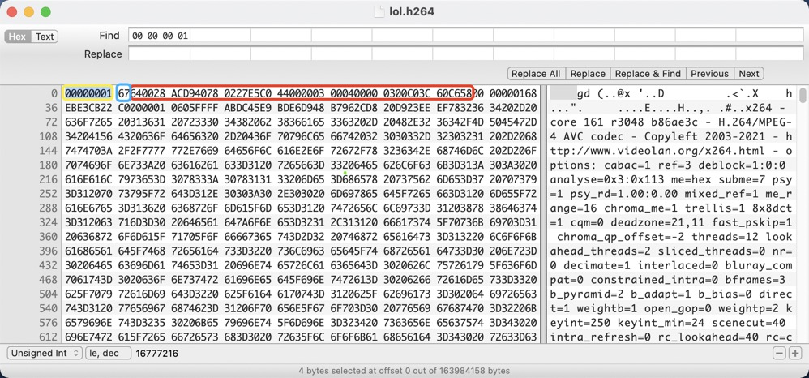

# H.264

> 国际上制定视频编解码技术的组织有两个，一个是 `国际电联（ITU-T）`，它制定的标准有 `H.261`、`H.263`、`H.263+` 等，另一个是 `国际标准化组织（ISO）` 它制定的标准有 `MPEG-1`、`MPEG-2`、`MPEG-4` 等。而 `H.264` 则是由两个组织联合组建的 `联合视频组（JVT）`共同制定的新数字视频编码标准，所以它既是 ITU-T 的 H.264，又是 ISO/IEC 的 MPEG-4 高级视频编码（Advanced Video Coding，`AVC`）的第 10 部分。因此，不论是 MPEG-4 AVC、MPEG-4 Part 10，还是 ISO/IEC 14496-10，都是指 `H.264`。

## 1、简介
**H.264**，同时也是MPEG-4第十部分，是由ITU-T视频编码专家组（VCEG）和ISO/IEC动态图像专家组（MPEG）联合组成的联合视频组（JVT，Joint Video Team）提出的高度压缩数字视频编解码器标准。这个标准通常被称之为 `H.264/AVC`（或者AVC/H.264或者H.264/MPEG-4 AVC或MPEG-4/H.264 AVC）。

## 2、H264 编码分层
`H.264` 被分为 `视频编码层（Video Coding Layer, VCL）` 和 `网络抽象层（Network Abstraction Layer, NAL）`。前者 `VCL` 关注编码部分，重点在于编码算法以及在特定硬件平台的实现；而后者 `NAL` 负责格式化数据以及包封装，以保证数据在各种信道和存储介质上的传输。

`视频编码层`涉及的概念：

- **视频压缩技术**：
  - 帧内预测压缩，解决的是空域数据冗余问题。
  - 帧间预测压缩（运动估计与补偿），解决的是时域数据冗徐问题。
  - 整数离散余弦变换（DCT），将空间上的相关性变为频域上无关的数据然后进行量化。
  - CABAC 压缩。
- **I帧**：关键帧，采用帧内压缩技术。
- **P帧**：向前参考帧，在压缩时，只参考前面已经处理的帧。采用帧间压缩技术。
- **B帧**：双向参考帧，在压缩时，它即参考前面的帧，又参考它后面的帧。采用帧间压缩技术。
- **GOP**：两个I帧之间是一个图像序列；一个图像序列中只有一个I帧。

`网络抽象层`涉及的概念：

- **SODB**：数据比特串（String Of Data Bits），即 `VCL` 编码后的最原始的数据（长度不一定是8的整数，故需补齐）。
- **RBSP**：原始数据字节流（Raw Byte Sequence Payload），即在 SODB 的后面添加了 `rbsp_trailing_bits`（第一个比特为1，接下来是0，直到字节对齐）。
- **Emulation Prevention Bytes**：防竞争码（0X03），即在编码时，每遇到连续两个 0x00 字节，就插入一个字节的0x03（如 0x000001 => 0x00000301）。解码时将0x03去掉。也称为脱壳操作。
- **EBSP**：扩展字节序列载荷（Extension Byte Sequence Payload），即在 RBSP 的基础上增加了防竞争码（0x03）。
- **NALU**：NAL单元（NAL Unit），包含NALU头和NALU主体（一般为RBSP）。
- **NALU Start Codes**：NALU包开始码，由于NALU中不包含大小/长度信息，因此不能直接连接NALU包来构建码流，因为无法知道开始、结束位置。通常使用 0x000001 或 0x00000001 作为开始码，四字节的开始码通常用于 SPS、PPS、IDR等NALU，其他采用三字节。

```
// 逻辑关系

SODB + rbsp_trailing_bits = RBSP

mixin(RBSP, 0x03) = EBSP

NALU header + NALU body(RBSP or EBSP) = NALU

NALU Start Codes + NALU + NALU Start Codes + NALU + ... = H.264 Bits Stream       // Annex-B
```

## 3、视频编码
TODO

## 4、NAL 单元结构
> 规定VCL是为了有效的表示视频数据的内容。规定NAL则是为了格式化数据，并以适用于存储介质或在多种通信信道上传输的格式提供头信息。NAL单元中包含了所有数据，每个NAL单元都是包含整数字节。NAL单元规定一种既适用于分组系统又适用于比特流系统的通用格式。用于分组传输和字节流的NAL单元的格式是一样的，不过字节流格式中的每个NAL单元前可以有一个起始码前缀和额外填充字节。

NAL 单元（简称 NALU）包含 NAL 头和 NAL 主体，其中 NAL 头占一个字节，结构如下：
```
+---------------+
|0|1|2|3|4|5|6|7|
+-+-+-+-+-+-+-+-+
|F|NRI|  Type   |
+---------------+
```
- forbidden_zero_bit：0 禁止位，1bit；
- nal_ref_idc：2bit，用来指示当前 NALU 的重要性。值越大，越重要，解码器在解码处理不过来时，可以丢弃重要性为0的NALU；
- Type：指 NALU 的类型，5bit，即范围为 0～31。

NALU 的类型，主要分为两类：1～5的NALU称为 VCL NALU（即视频编码后的数据），其余的称为 非 VCL NALU（一些配置信息）。NALU的类型码如下：

|TYPE|描述||分层|NRI|
|--|--|--|--|--|
|0| Unspecified | 未指定 | non-VCL|
|1| Coded slice of a non-IDR picture | 一个非IDR图像的编码条带 |VCL|
|2| Coded slice data partition A |编码条带分割数据块A|VCL|
|3| Coded slice data partition B |编码条带分割数据块B|VCL|
|4| Coded slice data partition C |编码条带分割数据块C|VCL|
|5| Coded slice of an IDR picture |IDR图像的编码条带|VCL|非0|
|6| Supplemental enhancement information (SEI) |辅助增强信息|non-VCL|0|
|7| Sequence parameter set |序列参数集|non-VCL|非0|
|8| Picture parameter set |图像参数集|non-VCL|非0|
|9| Access unit delimiter |访问单元分隔符|non-VCL|0|
|10| End of sequence |序列结尾|non-VCL|0|
|11| End of stream |流结尾|non-VCL|0|
|12| Filler data |填充数据|non-VCL|0|
|13| Sequence parameter set extension |序列参数集扩展|non-VCL|0|
|14..18| Reserved |保留|non-VCL|0|
|19| Coded slice of an auxiliary coded picture without partitioning |未分割的辅助编码图像的编码条带|non-VCL|0|
|20...23| Reserved |保留|non-VCL|0|
|24...31| Unspecified | 未指定 |non-VCL|0|

常见的RBSP数据结构类型有 `IDR_SLICE`、`SPS`、`PPS`、`SEI`，它们的 NAL header 常用取值为 `0x65`、`0x67`、`0x68`、`0x06`。通过具体的文件举例：
- 通过 ffmpeg 将本地 mp4 文件的 H264 码流剥离出来：`ffmpeg -i xx.mp4 xx.h264`;
- 得到的 `xx.h264` 即为 RBSP（or EBSP）码流；
- 
- 黄色部分为 `0x00000001` 开始码，蓝色部分为 NALU header，`0x67` 为 SPS 信息，红色部分为 NALU body（其中有两个防竞争码）。

## 5、H.264 基于 RTP 的传输结构
```
+----------------------+
|      RTP Packet      |
+--------+-------------+
| Header |   Payload   |
+--------+-------------+
                ⬇️
+----------------------+
|      RTP Payload     |
+----------------+-----+
| Payload Header | ... |
+----------------+-----+
         ⬇️
+-------------------------------+
|         Payload  Header       | 
+-------------------------------+
| 0 | 1 | 2 | 3 | 4 | 5 | 6 | 7 |
+---+---+---+---+---+---+---+---+
| F |    NRI    |     Type      |
+-------------------------------+
```

RTP 是实时传输协议，通过该协议打包 H.264 码流时，定义了三种不同类型的载荷结构。接收者可通过 RTP payload 的第一个字节（payload header）识别载荷结构，payload header 被格式化为 NALU header，与其结构、各字段含义一致。RTP 打包时使用了 24 ～ 31 的 TYPE 值，定义如下：

|TYPE|RTP载荷中NALU类型|载荷结构|
|-|-|-|
|0|未定义||
|1~23|单个NAL单元包|单个NAL单元包|
|24|STAP-A，单个时间的聚合包|聚合包|
|25|STAP-B，单个时间的聚合包|聚合包|
|26|MTAP16，多个时间的聚合包|聚合包|
|27|MTAP32，多个时间的聚合包|聚合包|
|28|FU-A，分片单元|分片单元|
|29|FU-B，分片单元|分片单元|
|30~31|未定义||

三种载荷类型分别为：

### 5.1、Single NAL Unit Packet
[单一NALU包](https://datatracker.ietf.org/doc/html/rfc3984#section-5.6)，即每个 NALU 都会被独立封装成一个 RTP 包。RTP 载荷结构如下：
```
 0                   1                   2                   3
 0 1 2 3 4 5 6 7 8 9 0 1 2 3 4 5 6 7 8 9 0 1 2 3 4 5 6 7 8 9 0 1
+-+-+-+-+-+-+-+-+-+-+-+-+-+-+-+-+-+-+-+-+-+-+-+-+-+-+-+-+-+-+-+-+
|F|NRI|  type   |                                               |
+-+-+-+-+-+-+-+-+                                               |
|                                                               |
|               Bytes 2..n of a Single NAL unit                 |
|                                                               |
|                               +-+-+-+-+-+-+-+-+-+-+-+-+-+-+-+-+
|                               :...OPTIONAL RTP padding        |
+-+-+-+-+-+-+-+-+-+-+-+-+-+-+-+-+-+-+-+-+-+-+-+-+-+-+-+-+-+-+-+-+
          RTP payload format for single NAL unit packet
```

### 5.2、Aggregation Packets
[聚合包](https://datatracker.ietf.org/doc/html/rfc3984#section-5.7)。当 H264 码流中有若干 NALU 尺寸特别小，因此需要将多个 NALU 封装到一个 RTP 包中。RTP 的载荷结构如下：
```
 0                   1                   2                   3
 0 1 2 3 4 5 6 7 8 9 0 1 2 3 4 5 6 7 8 9 0 1 2 3 4 5 6 7 8 9 0 1
+-+-+-+-+-+-+-+-+-+-+-+-+-+-+-+-+-+-+-+-+-+-+-+-+-+-+-+-+-+-+-+-+
|F|NRI|  type   |                                               |
+-+-+-+-+-+-+-+-+                                               |
|                                                               |
|             one or more aggregation units                     |
|                                                               |
|                               +-+-+-+-+-+-+-+-+-+-+-+-+-+-+-+-+
|                               :...OPTIONAL RTP padding        |
+-+-+-+-+-+-+-+-+-+-+-+-+-+-+-+-+-+-+-+-+-+-+-+-+-+-+-+-+-+-+-+-+
           RTP payload format for aggregation packets
```
聚合包分为两类：
- 单时间聚合包（STAP）：即聚合有着相同 NALU 时间的 NAL 单元。定义了两类 STAP，一类不包括 [DON](https://datatracker.ietf.org/doc/html/rfc3984#section-5.5)（STAP-A），在每个 NALU 前有两个字节的 NALU szie；另一类包括 [DON](https://datatracker.ietf.org/doc/html/rfc3984#section-5.5)（STAP-B），在 STAP-A 的基础上多了两个字节的 DON 字段。举例：
```
 0                   1                   2                   3
 0 1 2 3 4 5 6 7 8 9 0 1 2 3 4 5 6 7 8 9 0 1 2 3 4 5 6 7 8 9 0 1
+-+-+-+-+-+-+-+-+-+-+-+-+-+-+-+-+-+-+-+-+-+-+-+-+-+-+-+-+-+-+-+-+
|                          RTP Header                           |
+-+-+-+-+-+-+-+-+-+-+-+-+-+-+-+-+-+-+-+-+-+-+-+-+-+-+-+-+-+-+-+-+
|STAP-A NAL HDR |         NALU 1 Size           | NALU 1 HDR    |
+-+-+-+-+-+-+-+-+-+-+-+-+-+-+-+-+-+-+-+-+-+-+-+-+-+-+-+-+-+-+-+-+
|                         NALU 1 Data                           |
:                                                               :
+               +-+-+-+-+-+-+-+-+-+-+-+-+-+-+-+-+-+-+-+-+-+-+-+-+
|               | NALU 2 Size                   | NALU 2 HDR    |
+-+-+-+-+-+-+-+-+-+-+-+-+-+-+-+-+-+-+-+-+-+-+-+-+-+-+-+-+-+-+-+-+
|                         NALU 2 Data                           |
:                                                               :
|                               +-+-+-+-+-+-+-+-+-+-+-+-+-+-+-+-+
|                               :...OPTIONAL RTP padding        |
+-+-+-+-+-+-+-+-+-+-+-+-+-+-+-+-+-+-+-+-+-+-+-+-+-+-+-+-+-+-+-+-+
    1.An example of an RTP packet including an STAP-A and two
      single-time aggregation units

 0                   1                   2                   3
 0 1 2 3 4 5 6 7 8 9 0 1 2 3 4 5 6 7 8 9 0 1 2 3 4 5 6 7 8 9 0 1
+-+-+-+-+-+-+-+-+-+-+-+-+-+-+-+-+-+-+-+-+-+-+-+-+-+-+-+-+-+-+-+-+
|                          RTP Header                           |
+-+-+-+-+-+-+-+-+-+-+-+-+-+-+-+-+-+-+-+-+-+-+-+-+-+-+-+-+-+-+-+-+
|STAP-B NAL HDR | DON                           | NALU 1 Size   |
+-+-+-+-+-+-+-+-+-+-+-+-+-+-+-+-+-+-+-+-+-+-+-+-+-+-+-+-+-+-+-+-+
| NALU 1 Size   | NALU 1 HDR    | NALU 1 Data                   |
+-+-+-+-+-+-+-+-+-+-+-+-+-+-+-+-+                               +
:                                                               :
+               +-+-+-+-+-+-+-+-+-+-+-+-+-+-+-+-+-+-+-+-+-+-+-+-+
|               | NALU 2 Size                   | NALU 2 HDR    |
+-+-+-+-+-+-+-+-+-+-+-+-+-+-+-+-+-+-+-+-+-+-+-+-+-+-+-+-+-+-+-+-+
|                       NALU 2 Data                             |
:                                                               :
|                               +-+-+-+-+-+-+-+-+-+-+-+-+-+-+-+-+
|                               :...OPTIONAL RTP padding        |
+-+-+-+-+-+-+-+-+-+-+-+-+-+-+-+-+-+-+-+-+-+-+-+-+-+-+-+-+-+-+-+-+
    2.An example of an RTP packet including an STAP-B and two
      single-time aggregation units
```
- 多时间聚合包（MTAPs）：即聚合有着不同 NALU 时间的 NAL 单元。该 NALU 的结构为：一个16位的 DONB （decoding order number base）和一个或多个多时间聚合单元，如图1所示。MTAP 又分为了 MTAP16（图2）和 MTAP24（图三），它们的结构相似，区别是：MTAP16 在 DODN（decoding order number difference）后跟有一个16位的 timestamp offset (TS offset)，而 MTAP24 是24位。
```
 0                   1                   2                   3
 0 1 2 3 4 5 6 7 8 9 0 1 2 3 4 5 6 7 8 9 0 1 2 3 4 5 6 7 8 9 0 1
+-+-+-+-+-+-+-+-+-+-+-+-+-+-+-+-+-+-+-+-+-+-+-+-+-+-+-+-+-+-+-+-+
                :  decoding order number base   |               |
+-+-+-+-+-+-+-+-+-+-+-+-+-+-+-+-+-+-+-+-+-+-+-+-+               |
|                                                               |
|                 multi-time aggregation units                  |
|                                                               |
|                               +-+-+-+-+-+-+-+-+-+-+-+-+-+-+-+-+
|                               :
+-+-+-+-+-+-+-+-+-+-+-+-+-+-+-+-+
                   图1 MTAPs NALU 的载荷格式

 0                   1                   2                   3
 0 1 2 3 4 5 6 7 8 9 0 1 2 3 4 5 6 7 8 9 0 1 2 3 4 5 6 7 8 9 0 1
+-+-+-+-+-+-+-+-+-+-+-+-+-+-+-+-+-+-+-+-+-+-+-+-+-+-+-+-+-+-+-+-+
:        NAL unit size          |      DOND     |  TS offset    |
+-+-+-+-+-+-+-+-+-+-+-+-+-+-+-+-+-+-+-+-+-+-+-+-+-+-+-+-+-+-+-+-+
|  TS offset    |                                               |
+-+-+-+-+-+-+-+-+              NAL unit                         |
|                                                               |
|                               +-+-+-+-+-+-+-+-+-+-+-+-+-+-+-+-+
|                               :
+-+-+-+-+-+-+-+-+-+-+-+-+-+-+-+-+
                  图2 MTAP16 的多时间聚合单元格式

 0                   1                   2                   3
 0 1 2 3 4 5 6 7 8 9 0 1 2 3 4 5 6 7 8 9 0 1 2 3 4 5 6 7 8 9 0 1
+-+-+-+-+-+-+-+-+-+-+-+-+-+-+-+-+-+-+-+-+-+-+-+-+-+-+-+-+-+-+-+-+
:        NALU unit size         |      DOND     |  TS offset    |
+-+-+-+-+-+-+-+-+-+-+-+-+-+-+-+-+-+-+-+-+-+-+-+-+-+-+-+-+-+-+-+-+
|         TS offset             |                               |
+-+-+-+-+-+-+-+-+-+-+-+-+-+-+-+-+                               |
|                              NAL unit                         |
|                               +-+-+-+-+-+-+-+-+-+-+-+-+-+-+-+-+
|                               :
+-+-+-+-+-+-+-+-+-+-+-+-+-+-+-+-+
                  图4 MTAP24 的多时间聚合单元格式
```

### 5.3、Fragmentation Units (FUs)
分片单元。当 H264 码流中的 NALU 长度超过 MTU 大小限制时，需要进行分片。FUs 分为两类：FU-A（图5） 和 FU-B（图6），区别是 FU-B 携带了 DON 。其中 `FU indicator` 与 NULU header 的结构一致，type 为 28 或 29；`FU header` 的构成如图7所示，第一位 `S`（start）表示是否为开始分片，`E`（end）表示是否为结束分片，`R`（reserved）必须为0，5位的 `type` 表示 NALU 单元的类型。

```
 0                   1                   2                   3
 0 1 2 3 4 5 6 7 8 9 0 1 2 3 4 5 6 7 8 9 0 1 2 3 4 5 6 7 8 9 0 1
+-+-+-+-+-+-+-+-+-+-+-+-+-+-+-+-+-+-+-+-+-+-+-+-+-+-+-+-+-+-+-+-+
| FU indicator  |   FU header   |                               |
+-+-+-+-+-+-+-+-+-+-+-+-+-+-+-+-+                               |
|                                                               |
|                         FU payload                            |
|                                                               |
|                               +-+-+-+-+-+-+-+-+-+-+-+-+-+-+-+-+
|                               :...OPTIONAL RTP padding        |
+-+-+-+-+-+-+-+-+-+-+-+-+-+-+-+-+-+-+-+-+-+-+-+-+-+-+-+-+-+-+-+-+
                    图5 FU-A 的 RTP 载荷格式
                    
 0                   1                   2                   3
 0 1 2 3 4 5 6 7 8 9 0 1 2 3 4 5 6 7 8 9 0 1 2 3 4 5 6 7 8 9 0 1
+-+-+-+-+-+-+-+-+-+-+-+-+-+-+-+-+-+-+-+-+-+-+-+-+-+-+-+-+-+-+-+-+
| FU indicator  |   FU header   |               DON             |
+-+-+-+-+-+-+-+-+-+-+-+-+-+-+-+-+-+-+-+-+-+-+-+-+-+-+-+-+-+-+-+-|
|                                                               |
|                         FU payload                            |
|                                                               |
|                               +-+-+-+-+-+-+-+-+-+-+-+-+-+-+-+-+
|                               :...OPTIONAL RTP padding        |
+-+-+-+-+-+-+-+-+-+-+-+-+-+-+-+-+-+-+-+-+-+-+-+-+-+-+-+-+-+-+-+-+
                    图6 FU-B 的 RTP 载荷格式

+---------------+
|0|1|2|3|4|5|6|7|
+-+-+-+-+-+-+-+-+
|S|E|R|  Type   |
+---------------+
图7 FU header 结构
```

## 参考
- [H.264 百度百科](https://baike.baidu.com/item/H.264)
- [H.264/AVC Video Coding Standard](http://iphome.hhi.de/wiegand/assets/pdfs/DIC_H264_07.pdf)
- [RTP Payload Format for H.264 Video](https://datatracker.ietf.org/doc/html/rfc3984#section-1.3)
- [H264视频压缩算法 [blog]](https://www.cnblogs.com/pjl1119/p/9914861.html)
- [NAL Unit解析 [blog]](https://blog.csdn.net/weixin_36049506/article/details/96018124)
- [H264码流格式解析及RTP打包规则整理 [blog]](https://blog.csdn.net/luoyaxing0812/article/details/111352155)
- [视频和视频帧：H264编码格式整理 [blog]](https://zhuanlan.zhihu.com/p/71928833)