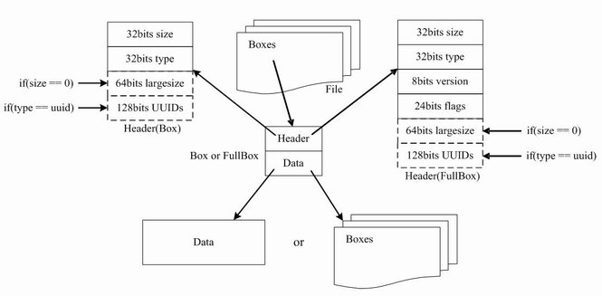

## MP4 (MPEG-4 Part 14)

## 前言
MP4 是 MPEG-4 标准中第14部分，即 [MPEG-4 Part 14](./docs/lib/part14.pdf)，是一种常见的音视频容器格式，由国际标准化组织（ISO）和国际电工委员会（IEC）下属的“动态图像专家组”（Moving Picture Experts Group，即MPEG）制定，扩展名常为 `.mp4`。MPEG-4 Part 14 是更通用的 [MPEG-4 Part12(ISO base media file format, ISOBMFF)](./docs/lib/part12.pdf) 的一个实例，Part12 定义了容器格式的通用结构，而 Part14 细化描述了用于存储 MPEG-4 内容的容器格式，他们的关系如下图：


## MP4 文件结构
MP4文件由很多个 `box` 组成，所有的视频信息、视频数据都在这些 `box` 中。`box` 内部分为两部分：`header` 和 `data`，`header` 描述了当前 `box` 的大小（size）和类型（type），而 `data` 里面存放了具体的数据或子 `box` （包含子box的盒子称为容器盒子 `container box`）。
- `box header` 中的 **size** 表示整个盒子的长度（包含header自身、子box长度等），占32位。特殊情况：当size为0时，表示是最后一个 `box` ；当size为1时，表示 `box` 的长度需要更多的bit来描述（64位的largesize表示）。
- `box header` 中的 **type** 表示盒子的类型，占32位，内容即为盒子英文类型的 ASCII 码。特殊情况：当type为uuid时，后续会有个用户自定义盒子类型。

`box` 结构的伪代码：
```c++
aligned(8) class Box (unsigned int(32) boxtype, optional unsigned int(8)[16] extended_type) {
  unsigned int(32) size;
  unsigned int(32) type = boxtype;
  if (size==1) {
    unsigned int(64) largesize;
  } else if (size==0) {
    // box extends to end of file
  }
  if (boxtype==‘uuid’) {
    unsigned int(8)[16] usertype = extended_type;
  }
} 
```

除了上述的 `box` ，还有一种基于它的扩展类 `full box` ，就是在其基础上增加了 8bit version 和 24bit flags，伪代码如下：
```c++
aligned(8) class FullBox(unsigned int(32) boxtype, unsigned int(8) v, bit(24) f)
 extends Box(boxtype) {
 unsigned int(8) version = v;
 bit(24) flags = f;
} 
```

综上，mp4的文件格式如下图所示：



## MP4 盒子类型
|类型10|  |  |  |  |  |重要性|章节|描述|
|--|--|--|--|--|--|--|--|--|
|ftyp||||||*|4.3| file type and compatibility|
|pdin|||||||8.43|progressive download information|
|moov||||||*|8.1| container for all the metadata|
||mvhd|||||*|8.3|movie header, overall declarations|
||trak|||||*|8.4|container for an individual track or stream|
|||tkhd||||*|8.5|track header, overall information about the track|
|||tref|||||8.6|track reference container|
|||edts|||||8.25|edit list container|
||||elst||||8.26|an edit list|
|||mdia||||*|8.7|container for the media information in a track|
||||mdhd|||*|8.8|media header, overall information about the media|
||||hdlr|||*|8.9|handler, declares the media (handler) type|
||||minf|||*|8.10|media information container|
|||||vmhd|||8.11.2|video media header, overall information (video track only)|
|||||smhd|||8.11.3|sound media header, overall information (sound track only)|
|||||hmhd|||8.11.4|hint media header, overall information (hint track only)|
|||||nmhd|||8.11.5|Null media header, overall information (some tracks only)|
|||||dinf||*|8.12|data information box, container|
||||||dref|*|8.13|data reference box, declares source(s) of media data in track|
|||||stbl||*|8.14|sample table box, container for the time/space map|
||||||stsd|*|8.16|sample descriptions (codec types, initialization etc.)|
||||||stts|*|8.15.2|(decoding) time-to-sample|
||||||ctts||8.15.3|(composition) time to sample|
||||||stsc|*|8.18|sample-to-chunk, partial data-offset information|
||||||stsz||8.17.2|sample sizes (framing)|
||||||stz2||8.17.3|compact sample sizes (framing)|
||||||stco|*|8.19|chunk offset, partial data-offset information|
||||||co64||8.19|64-bit chunk offset|
||||||stss||8.20|sync sample table (random access points)|
||||||stsh||8.21|shadow sync sample table|
||||||padb||8.23|sample padding bits|
||||||stdp||8.22|sample degradation priority|
||||||sdtp||8.40.2|independent and disposable samples|
||||||sbgp||8.40.3.2|sample-to-group|
||||||sgpd||8.40.3.3|sample group description|
||||||subs||8.42|sub-sample information|
||mvex||||||8.29|movie extends box|
|||mehd|||||8.30|movie extends header box|
|||trex||||*|8.31|track extends defaults|
||ipmc||||||8.45.4|IPMP Control Box|
|moof|||||||8.32|movie fragment|
||mfhd|||||*|8.33|movie fragment header|
||traf||||||8.34|track fragment|
|||tfhd||||*|8.35|track fragment header|
|||trun|||||8.36|track fragment run|
|||sdtp|||||8.40.2|independent and disposable samples|
|||sbgp|||||8.40.3.2|sample-to-group|
|||subs|||||8.42|sub-sample information|
|mfra|||||||8.37|movie fragment random access|
||tfra||||||8.38|track fragment random access|
||mfro|||||*|8.39|movie fragment random access offset|
|mdat|||||||8.2|media data container|
|free|||||||8.24|free space|
|skip|||||||8.24|free space|

## JS 封装 mp4 box
 `box` 的封装，只需要指定 `box type` 和数据内容 `data` （忽略 `largesize` 和 `uuid` 这两种特殊情况）。示例代码如下：
```typescript
function Box (type: string, ...payloads: Uint8Array[]) {
  // 盒子长度为 头部8字节 + 载荷数据总长度
  const size = 8 + payloads.reduce((sum, cur) => (sum += cur.byteLength), 0);
  const box = new Uint8Array(size);

  // size
  box[0] = (size >> 24) & 0xff;
  box[1] = (size >> 16) & 0xff;
  box[2] = (size >> 8) & 0xff;
  box[3] = size & 0xff;

  // type
  box[4] = type.charCodeAt(0);
  box[5] = type.charCodeAt(1);
  box[6] = type.charCodeAt(2);
  box[7] = type.charCodeAt(3);

  // data
  let offset = 8;
  payloads.forEach(playload => {
    box.set(playload, offset);
    offset += playload.byteLength;
  });

  return box;
}
```

 `full box` 是 box 的扩展，box 结构的基础上在 header 中增加 8bits version 和 24bits flags。示例代码如下：
```typescript
function FullBox (type: string, version: number, flags: number, ...payloads: Uint8Array[]) {
  return Box(
    type,
    new Uint8Array([
      version & 0xff,
      (flags >> 16) & 0xff,
      (flags >> 8) & 0xff,
      flags & 0xff
    ]),
    ...payloads
  );
}
```

接下来用 JS 去实现不同 mp4 box。

### ftyp
`ftyp` 是 `File Type Box` 的简写，它描述了该 mp4 的解码标准，如解码版本、兼容格式等。通常 ftyp 都是放在 mp4 等开头。格式如下：
```cpp
aligned(8) class FileTypeBox
  extends Box(‘ftyp’) {
  unsigned int(32) major_brand;
  unsigned int(32) minor_version;
  unsigned int(32) compatible_brands[]; // to end of the box
} 
```
上述字段的含义如下：
- major_brand: 比如常见的 isom、mp41、mp42、avc1、qt等。它表示“最好”基于哪种格式来解析当前的文件。一般而言都是使用 isom 这个万金油即可。如果是需要特定的格式，可以自行定义。
- minor_version: 指major_brand的最低兼容版本。
- compatible_brands: 和 major_brand 类似，通常是针对 MP4 中包含的额外格式，比如，AVC，AAC 等相当于的音视频解码格式。

js 实现方式：
```typescript
function ftyp (
  major_brand = 'isom',
  minor_version = 1,
  compatible_brands = ['avc1']
) {
  return Box(
    'ftyp',
    new Uint8Array([
      major_brand.charCodeAt(0),
      major_brand.charCodeAt(1),
      major_brand.charCodeAt(2),
      major_brand.charCodeAt(3),  // major_brand
      (minor_version >> 24),
      (minor_version >> 16) & 0xFF,
      (minor_version >>  8) & 0xFF,
      minor_version & 0xFF,       // minor_version
    ]),
    ...compatible_brands.map(brand => new Uint8Array([
      brand.charCodeAt(0),
      brand.charCodeAt(1),
      brand.charCodeAt(2),
      brand.charCodeAt(3)
    ]))                           // compatible_brands
  );
}

// eg: Uint8Array(20) [0 0 0 20 102 116 121 112 105 115 111 109 0 0 0 1 97 118 99 49]
```

### moov
`moov` 是 `Movie Box` 的缩写，它本身并不具备有用信息，但子盒子中包含了媒体播放所需的元数据，如视频的编码等级、分辨率，音频的声道、采样率等。格式如下：
```cpp
aligned(8) class MovieBox extends Box(‘moov’){ }
```
次级盒子主要有：**mvhd**、**trak**、**mvex**

### moov::mvhd
`mvhd` 是 `MovieHeaderBox` 的缩写，描述了媒体文件的整体信息，如创建时间、文件时长等。格式如下：
```cpp
aligned(8) class MovieHeaderBox extends FullBox(‘mvhd’, version, 0) {
  if (version==1) {
    unsigned int(64) creation_time;
    unsigned int(64) modification_time;
    unsigned int(32) timescale;
    unsigned int(64) duration;
  } else { // version==0
    unsigned int(32) creation_time;
    unsigned int(32) modification_time;
    unsigned int(32) timescale;
    unsigned int(32) duration;
  }
  template int(32) rate = 0x00010000; // typically 1.0
  template int(16) volume = 0x0100; // typically, full volume˝
  const bit(16) reserved = 0;
  const unsigned int(32)[2] reserved = 0;
  template int(32)[9] matrix =
  { 0x00010000,0,0,0,0x00010000,0,0,0,0x40000000 };
  // Unity matrix
  bit(32)[6] pre_defined = 0;
  unsigned int(32) next_track_ID;
}
```
上述字段的含义如下：
- creation_time 表示文件的创建时间（从UTC时间的1904年1月1日0点至今的秒数）；
- modification_time 表示文件的修改时间；
- timescale 表示一秒包含的时间单位（文件内所有时间的计算都要以它为参照）；
- duration 表示媒体的可播放时长，**duration / timescale = 可播放时长（S）**；
- rate 表示媒体的原始倍速，高16位代表整数部分、低16位代表小数部分；
- volume 表示媒体的音量，高8位代表整数部分、低8位代表小数部分；
- matrix 表示媒体的转换矩阵，忽略；
- next_track_ID 表示下个轨道的ID，非零整型，忽略。

JS 实现方式：
```typescript
function mvhd (timescale: number, duration: number) {
  return FullBox(
    'mvhd', 0, 0,
    new Uint8Array([
      0x00, 0x00, 0x00, 0x00,       // creation_time
      0x00, 0x00, 0x00, 0x00,       // modification_time
      (timescale >> 24) & 0xFF,
      (timescale >> 16) & 0xFF,
      (timescale >>  8) & 0xFF,
      timescale & 0xFF,             // timescale
      (duration >> 24) & 0xFF,
      (duration >> 16) & 0xFF,
      (duration >>  8) & 0xFF,
      duration & 0xFF,              // duration
      0x00, 0x01, 0x00, 0x00,       // 1.0 rate
      0x01, 0x00,                   // 1.0 volume
      0x00, 0x00,                   // reserved
      0x00, 0x00, 0x00, 0x00,       // reserved
      0x00, 0x00, 0x00, 0x00,       // reserved
      0x00, 0x01, 0x00, 0x00,
      0x00, 0x00, 0x00, 0x00,
      0x00, 0x00, 0x00, 0x00,
      0x00, 0x00, 0x00, 0x00,
      0x00, 0x01, 0x00, 0x00,
      0x00, 0x00, 0x00, 0x00,
      0x00, 0x00, 0x00, 0x00,
      0x00, 0x00, 0x00, 0x00,
      0x40, 0x00, 0x00, 0x00,       // matrix
      0x00, 0x00, 0x00, 0x00,
      0x00, 0x00, 0x00, 0x00,
      0x00, 0x00, 0x00, 0x00,
      0x00, 0x00, 0x00, 0x00,
      0x00, 0x00, 0x00, 0x00,
      0x00, 0x00, 0x00, 0x00,       // pre_defined
      0xff, 0xff, 0xff, 0xff        // next_track_ID
    ])
  );
}
```

### moov::trak
`trak` 是 `Track Box` 的缩写，它是容器盒子，其次级盒子中包含了单个媒体轨道（track）的描述信息。格式如下：
```cpp
aligned(8) class TrackBox extends Box(‘trak’) {}
```
次级盒子主要有：**tkhd**、**mdia** 等。

### moov::trak::tkhd
`tkhd` 是 `Track Header Box` 的缩写，它包含了单个媒体轨道的描述信息。格式如下：
```cpp
aligned(8) class TrackHeaderBox
  extends FullBox(‘tkhd’, version, flags){
  if (version==1) {
    unsigned int(64) creation_time;
    unsigned int(64) modification_time;
    unsigned int(32) track_ID;
    const unsigned int(32) reserved = 0;
    unsigned int(64) duration;
  } else { // version==0
    unsigned int(32) creation_time;
    unsigned int(32) modification_time;
    unsigned int(32) track_ID;
    const unsigned int(32) reserved = 0;
    unsigned int(32) duration;
  }
  const unsigned int(32)[2] reserved = 0;
  template int(16) layer = 0;
  template int(16) alternate_group = 0;
  template int(16) volume = {if track_is_audio 0x0100 else 0};
  const unsigned int(16) reserved = 0;
  template int(32)[9] matrix=
  { 0x00010000,0,0,0,0x00010000,0,0,0,0x40000000 };
  // unity matrix
  unsigned int(32) width;
  unsigned int(32) height;
}
```
上述字段的含义如下：
- flags 通过按位或计算得到，默认值为7（即0b0111），表示这个track是启用的、用于播放的且用于预览的。
  - Track_enabled：值为0x000001，表示这个track是启用的，当值为0x000000，表示这个track没有启用；
  - Track_in_movie：值为0x000002，表示当前track在播放时会用到；
  - Track_in_preview：值为0x000004，表示当前track用于预览模式；
- creation_time 文件创建时间；
- modification_time 文件修改时间；
- track_ID 轨道ID，不能为0；
- duration 当前轨道的时长（需要与timescale计算）；
- layer 视频轨道的叠加层级，越小越处于顶级（靠近观看者）；
- alternate_group 当前track的分组ID。同一分组的track，在同一时间只能有一个track处于播放状态；当分组ID为0时，表示没有其他track跟当前track处于同一分组；一个分组内，也可以只有一个track；
- volume 音频轨道的音量；
- matrix 视频的变换矩阵；
- width 视频宽，高16位代表整数部分、低16位代表小数部分；
- height 视频高，高16位代表整数部分、低16位代表小数部分；

JS 实现方式：
```typescript
function tkhd (track: IBoxTrack) {
  const { id, duration, isAudio, width, height } = track;
  return FullBox(
    'tkhd', 0, 7,
    new Uint8Array([
      0x00, 0x00, 0x00, 0x00, // creation_time
      0x00, 0x00, 0x00, 0x00, // modification_time
      (id >> 24) & 0xFF,
      (id >> 16) & 0xFF,
      (id >> 8) & 0xFF,
      id & 0xFF, // track_ID
      0x00, 0x00, 0x00, 0x00, // reserved
      (duration >> 24),
      (duration >> 16) & 0xFF,
      (duration >>  8) & 0xFF,
      duration & 0xFF, // duration
      0x00, 0x00, 0x00, 0x00,
      0x00, 0x00, 0x00, 0x00, // reserved
      0x00, 0x00, // layer
      0x00, 0x00, // alternate_group
      (isAudio ? 0x01 : 0x00), 0x00, // track volume
      0x00, 0x00, // reserved
      0x00, 0x01, 0x00, 0x00,
      0x00, 0x00, 0x00, 0x00,
      0x00, 0x00, 0x00, 0x00,
      0x00, 0x00, 0x00, 0x00,
      0x00, 0x01, 0x00, 0x00,
      0x00, 0x00, 0x00, 0x00,
      0x00, 0x00, 0x00, 0x00,
      0x00, 0x00, 0x00, 0x00,
      0x40, 0x00, 0x00, 0x00, // transformation: unity matrix
      (width >> 8) & 0xFF,
      width & 0xFF,
      0x00, 0x00, // width
      (height >> 8) & 0xFF,
      height & 0xFF,
      0x00, 0x00 // height
    ])
  );
}
```

### moov::trak::mdia
`mdia` 是 `Media Box` 的缩写，是一个container box，里面包含了该track内的所有媒体信息。格式如下：
```cpp
aligned(8) class MediaBox extends Box(‘mdia’) {}
```
次级盒子主要有：**mdhd**、**hdlr**、**minf** 等。

### moov::trak::mdia::mdhd
 mdhd 是 `Media Header Box` 的缩写，包含了媒体特征相关信息。格式如下：
```cpp
aligned(8) class MediaHeaderBox extends FullBox(‘mdhd’, version, 0) {
  if (version==1) {
    unsigned int(64) creation_time;
    unsigned int(64) modification_time;
    unsigned int(32) timescale;
    unsigned int(64) duration;
  } else { // version==0
    unsigned int(32) creation_time;
    unsigned int(32) modification_time;
    unsigned int(32) timescale;
    unsigned int(32) duration;
  }
  bit(1) pad = 0;
  unsigned int(5)[3] language; // ISO-639-2/T language code
  unsigned int(16) pre_defined = 0;
} 
```
上述字段中，language 表明当前媒体的语言，由三个小写字母组成（如zho-中文，eng-英语，und-未定义等），每个字符被压缩为其 `ASCII` 值和 `0x60` 之间的差值，每个字符占 5bits。如：und 的 ASCII 为 117、110、100，与 0x60 的差为 21、14、4，则 language 的值为 (21 << 10) + (14 << 5) + 4 = **0x55C4**。

JS 实现方式：
```typescript
function mdhd ({
  timescale,
  duration
}: IBoxTrack) {
  return FullBox(
    'mdhd', 0, 0,
    new Uint8Array([
      0x00, 0x00, 0x00, 0x00, // creation_time
      0x00, 0x00, 0x00, 0x00, // modification_time
      (timescale >> 24) & 0xFF,
      (timescale >> 16) & 0xFF,
      (timescale >>  8) & 0xFF,
      timescale & 0xFF, // timescale
      (duration >> 24),
      (duration >> 16) & 0xFF,
      (duration >>  8) & 0xFF,
      duration & 0xFF, // duration
      0x55, 0xc4, // 'und' language (undetermined)
      0x00, 0x00
    ])
  );
}
```

### moov::trak::mdia::hdlr
`hdlr` 是 `Handler Box` 的缩写，用于设置不同 track 的处理方式。格式如下：
```cpp
aligned(8) class HandlerBox extends FullBox(‘hdlr’, version = 0, 0) {
  unsigned int(32) pre_defined = 0;
  unsigned int(32) handler_type;
  const unsigned int(32)[3] reserved = 0;
  string name;
}
```
上述字段的含义如下：
- handler_type 指 track 的处理类型，如：
  - vide：指 Video Track
  - soun: 指 Audio Track
- name 自定义名称，以 0x00 结尾的字符串。

JS 实现方式：
```typescript
function hdlr (track: IBoxTrack) {
  const type = track.isVideo
    ? [0x76, 0x69, 0x64, 0x65]    // 'vide'
    : [0x73, 0x6f, 0x75, 0x6e];   // 'soun'

  const name = track.isVideo
    ? string2buffer('Video Handler')
    : string2buffer('Audio Handler');

  return FullBox(
    'hdlr', 0, 0,
    new Uint8Array([
      0x00, 0x00, 0x00, 0x00, // pre_defined
      ...type,                // handler_type
      0x00, 0x00, 0x00, 0x00,
      0x00, 0x00, 0x00, 0x00,
      0x00, 0x00, 0x00, 0x00, // reserved
      ...name, 0x00           // name：a null-terminated string
    ])
  );
}
 ```

### moov::trak::mdia::minf
`minf` 是 `Media Information Box` 的缩写，是一个 container box，内部包含了当前 track 中所有的媒体特征信息。定义如下：
```cpp
aligned(8) class MediaInformationBox extends Box(‘minf’) {}
```
次级盒子主要有：**\*mhd**（如vmhd/smhd/hmhd/nmhd）、**dinf**、**stbl**。

### moov::trak::mdia::minf::*mhd
媒体信息头（ `Media Information Header Boxes`）在不同类型的 track 中都不一样，比如 vmhd(Video Media Header Box)、smhd(Sound Media Header Box)、hmhd(Hint Media Header Box)、nmhd(Null Media Header Box) 等。

 `vmhd` 的定义如下：
```cpp
aligned(8) class VideoMediaHeaderBox
  extends FullBox(‘vmhd’, version = 0, 1) {
  template unsigned int(16) graphicsmode = 0; // copy, see below
  template unsigned int(16)[3] opcolor = {0, 0, 0};
} 
```
`smhd` 的定义如下：
```cpp
aligned(8) class SoundMediaHeaderBox
  extends FullBox(‘smhd’, version = 0, 0) {
  template int(16) balance = 0;
  const unsigned int(16) reserved = 0;
} 
```

### moov::trak::mdia::minf::dinf
`dinf` 是 `Data Information Box` 的缩写，它是一个 container box，定义了媒体信息在 track 中的位置。定义如下：
```cpp
aligned(8) class DataInformationBox extends Box(‘dinf’) {}
```
次级盒子为 **dref** 。

### moov::trak::mdia::minf::dinf::dref
`dref` 是 `Data Reference Box` 的缩写，它包含一个数据引用表（通常为URL），指定了媒体数据的位置。格式如下：
```cpp
aligned(8) class DataReferenceBox
  extends FullBox(‘dref’, version = 0, 0) {
  unsigned int(32) entry_count;
  for (i=1; i • entry_count; i++) { entry_count; i++) {
    DataEntryBox(entry_version, entry_flags) data_entry;
  }
}
```
上述的 `DataEntryBox` 指 `DataEntryUrlBox` 或 `DataEntryUrnBox`，定义见下。
```cpp
aligned(8) class DataEntryUrlBox (bit(24) flags)
  extends FullBox(‘url ’, version = 0, flags) {
  string location;
}
aligned(8) class DataEntryUrnBox (bit(24) flags)
  extends FullBox(‘urn ’, version = 0, flags) {
  string name;
  string location;
} 
```
其中 entry_flags 为 `0x00000x` 时，表示媒体数据和包含此引用的 moov box 位于同一文件。所以 JS 实现如下即可：
```typescript
function dref () {
  return FullBox(
    'dref', 0, 0,
    new Uint8Array([0x00, 0x00, 0x00, 0x01]), // entry_count 
    FullBox('url ', 0, 1)
  );
}
```

### moov::trak::mdia::minf::stbl
`stbl` 是 `Sample Table Box` 的缩写，是一个容器盒子，表明了当前track中媒体数据的时间和索引信息等。定义如下：
```cpp
aligned(8) class SampleTableBox extends Box(‘stbl’) { }
```
次级盒子主要有：**stsd**、**stts**、**stsc**、**stsz**、**stco** 等。

### moov::trak::mdia::minf::stbl::stsd
`stsd` 是 `Sample Description Box` 的缩写，存储了编码类型和初始化解码器需要的信息，不同类型的轨道、不同的媒体格式都有着不一样的定义。定义如下：
```cpp
aligned(8) class SampleDescriptionBox (unsigned int(32) handler_type)
  extends FullBox('stsd', 0, 0){
  int i ;
  unsigned int(32) entry_count;
  for (i = 1 ; i <= entry_count ; i++){
    switch (handler_type){
      case ‘soun’: // for audio tracks
        AudioSampleEntry();
        break;
      case ‘vide’: // for video tracks
        VisualSampleEntry();
        break;
      case ‘hint’: // Hint track
        HintSampleEntry();
        break;
    }
  }
} 
```
JS 实现方式如下（只考虑了视频和音频）：
```typescript
function stsd (track: IBoxTrack) {
  const sampleEntryBox = track.isVideo
    ? VisualSampleEntryBox(track)
    : AudioSampleEntryBox(track);
  
  return FullBox(
    'stsd', 0, 0,
    new Uint8Array([0x00, 0x00, 0x00, 0x01]), // entry_count
    sampleEntryBox
  );
}
```
上述中 `xxxxSampleEntry` 在不同的编码格式中都有不同的格式，首先他们都继承抽象类 `SampleEntry` ，定义如下：
```cpp
aligned(8) abstract class SampleEntry (unsigned int(32) format)
  extends Box(format){
  const unsigned int(8)[6] reserved = 0;
  unsigned int(16) data_reference_index;
}
```
上述字段的含义如下：
- format 指视频或音频的编码格式，如 aac 音频的编码格式为 `mp4a`，AVC-1/H.264 视频的编码格式为 `avc1`；
- data_reference_index 利用这个索引可以检索与当前 sample description 关联的数据。数据引用存储在 dref box。

对于视频轨道，需要按 `VisualSampleEntry` 定义，是各种编码格式（H264、H265）的基类，*ISO/IEC 14496-12** 只定义这个基类，具体编码格式的定义在其他文档中定义，如 H264 的定义在 [ISO/IEC 14496-15](./docs/lib/part15.pdf) 中为 `AVCSampleEntry`（下文会详细介绍）。`VisualSampleEntry` 定义如下：
```cpp
class VisualSampleEntry(codingname) extends SampleEntry (codingname){
  unsigned int(16) pre_defined = 0;
  const unsigned int(16) reserved = 0;
  unsigned int(32)[3] pre_defined = 0;
  unsigned int(16) width;
  unsigned int(16) height;
  template unsigned int(32) horizresolution = 0x00480000; // 72 dpi
  template unsigned int(32) vertresolution = 0x00480000; // 72 dpi
  const unsigned int(32) reserved = 0;
  template unsigned int(16) frame_count = 1;
  string[32] compressorname;
  template unsigned int(16) depth = 0x0018;
  int(16) pre_defined = -1;
}
```
上述字段的含义如下：
- width、height 视频宽高；
- horizresolution、vertresolution 每英寸的像素值(dpi)，[16.16]格式；
- frame_count 每个sample中的视频帧数，默认是1。

对于音频轨道，需要按 `AudioSampleEntry` 定义：
```cpp
class AudioSampleEntry(codingname) extends SampleEntry (codingname){
  const unsigned int(32)[2] reserved = 0;
  template unsigned int(16) channelcount = 2;
  template unsigned int(16) samplesize = 16;
  unsigned int(16) pre_defined = 0;
  const unsigned int(16) reserved = 0 ;
  template unsigned int(32) samplerate = {timescale of media}<<16;
} 
```
上述字段的含义如下：
- channelcount 音频通道个数；
- samplesize 音频的采样位数；
- samplerate 音频的采样率，[16.16]格式。

### moov::trak::mdia::minf::stbl::stsd::avc1
`AVCSampleEntry` 继承了 `VisualSampleEntry` ，构造时 codingname 为 `avc1`。定义如下：
```cpp
class AVCSampleEntry() extends VisualSampleEntry (‘avc1’){
  AVCConfigurationBox config;
  MPEG4BitRateBox (); // optional
  MPEG4ExtensionDescriptorsBox (); // optional
}
```

H264 编码格式，其 AVCSampleEntry 的 JS 实现方式如下：
```typescript
function VisualSampleEntryBox (track: IBoxTrack) {
  const { width, height, format } = track;
  const extraBoxes = getExtraEntryBoxs(track);

  return Box(
    format,
    new Uint8Array([
      0x00, 0x00, 0x00, 0x00, 0x00, 0x00, // reserved
      0x00, 0x01, // data_reference_index
      0x00, 0x00, // pre_defined
      0x00, 0x00, // reserved
      0x00, 0x00, 0x00, 0x00,
      0x00, 0x00, 0x00, 0x00,
      0x00, 0x00, 0x00, 0x00, // pre_defined
      (width >> 8) & 0xff, width & 0xff, // width
      (height >> 8) & 0xff, height & 0xff, // height
      0x00, 0x48, 0x00, 0x00, // horiz_reslution
      0x00, 0x48, 0x00, 0x00, // vert_resolution
      0x00, 0x00, 0x00, 0x00, // reserved
      0x00, 0x01, // frame_count
      0x00, 0x00, 0x00, 0x00,
      0x00, 0x00, 0x00, 0x00,
      0x00, 0x00, 0x00, 0x00,
      0x00, 0x00, 0x00, 0x00,
      0x00, 0x00, 0x00, 0x00,
      0x00, 0x00, 0x00, 0x00,
      0x00, 0x00, 0x00, 0x00,
      0x00, 0x00, 0x00, 0x00, // compressorname 32 bytes
      0x00, 0x18, // depth 0x0018
      0xff, 0xff  // pre_defined -1
    ]),
    ...extraBoxes
  );
}

function getExtraEntryBoxs (track: IBoxTrack) {
  let boxes: Uint8Array[] = [];
  switch (track.format) {
    case 'avc1':
      boxes.push(avcC(track));
      boxes.push(brtr());
      break;
    case ...
  }
  return boxes;
}
```

### moov::trak::mdia::minf::stbl::stsd::avc1::avcC
`avcC` 是 `AVC Configuration Box` 的缩写，
```cpp
class AVCConfigurationBox extends Box(‘avcC’) {
  AVCDecoderConfigurationRecord() AVCConfig;
}

aligned(8) class AVCDecoderConfigurationRecord {
  unsigned int(8) configurationVersion = 1;
  unsigned int(8) AVCProfileIndication;
  unsigned int(8) profile_compatibility;
  unsigned int(8) AVCLevelIndication;
  bit(6) reserved = ‘111111’b;
  unsigned int(2) lengthSizeMinusOne;
  bit(3) reserved = ‘111’b;
  unsigned int(5) numOfSequenceParameterSets;
  for (i=0; i< numOfSequenceParameterSets; i++) {
    unsigned int(16) sequenceParameterSetLength ;
    bit(8*sequenceParameterSetLength) sequenceParameterSetNALUnit;
  }
  unsigned int(8) numOfPictureParameterSets;
  for (i=0; i< numOfPictureParameterSets; i++) {
    unsigned int(16) pictureParameterSetLength;
    bit(8*pictureParameterSetLength) pictureParameterSetNALUnit;
  }
  if( profile_idc == 100 || profile_idc == 110 ||
    profile_idc == 122 || profile_idc == 144 )
  {
    bit(6) reserved = ‘111111’b;
    unsigned int(2) chroma_format;
    bit(5) reserved = ‘11111’b;
    unsigned int(3) bit_depth_luma_minus8;
    bit(5) reserved = ‘11111’b;
    unsigned int(3) bit_depth_chroma_minus8;
    unsigned int(8) numOfSequenceParameterSetExt;
    for (i=0; i< numOfSequenceParameterSetExt; i++) {
      unsigned int(16) sequenceParameterSetExtLength;
      bit(8*sequenceParameterSetExtLength) sequenceParameterSetExtNALUnit;
    }
  }
}
```

### moov::trak::mdia::minf::stbl::stsd::avc1::brtr
`brtr` 是 `MPEG4 Bit Rate Box` 的缩写，定义如下：
```cpp
class MPEG4BitRateBox extends Box(‘btrt’){
  unsigned int(32) bufferSizeDB;
  unsigned int(32) maxBitrate;
  unsigned int(32) avgBitrate;
} 
```

### moov::trak::mdia::minf::stbl::stts

### moov::trak::mdia::minf::stbl::stsc

### moov::trak::mdia::minf::stbl::stsz

### moov::trak::mdia::minf::stbl::stco

### moov::mvex

### moov::mvex::trex

### moof


### moof::mfhd

### moof::traf

### moof::traf::tfhd

### moof::traf::tfdt

### moof::traf::trun

### moof::traf::sdtp

### mdat
`mdat` 是 `Meida Data Box` 的缩写，里面存放了媒体数据，一个 MP4 文件可能有零个或多个 `mdat box`。媒体数据直接跟在 `box type` 后，具体结构的定义需要参考 metadata（主要在sample table中描述），`mdat box` 定义如下：
```cpp
aligned(8) class MediaDataBox extends Box(‘mdat’) {
  bit(8) data[];
} 
```

# 参考
- [Part 12: ISO base media file format](./docs/lib/part12.pdf)
- [Part 14: MP4 file format](./docs/lib/part14.pdf)
- [MP4文件格式入门【blog】](https://www.imooc.com/article/313004)
- [mp4文件格式解析【blog】](https://www.jianshu.com/p/529c3729f357)
