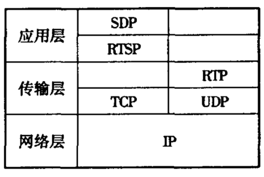
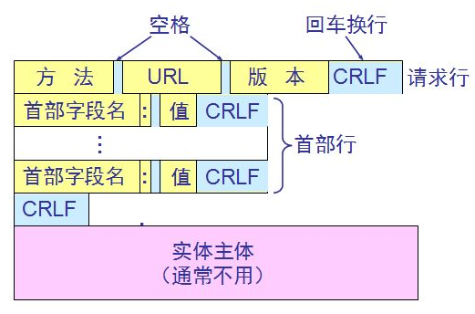
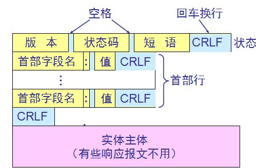

# RTSP - 实时流传输协议

## 简介
RTSP（Real Time Streaming Protocol），实时流传输协议，属于 TCP/IP 协议体系中的应用层协议，但我们生活中说的 RTSP 常指 RTSP 协议族，分别有：

- RTSP协议：负责服务端与客户端之间的请求，主要提供视频控制能力；
- RTP协议：负责传输视频数据；
- RTCP协议：负责反馈传输质量信息。

在 RTSP 协议中，也会传递 SDP 媒体描述信息。他们的关系通常如下图所示：


## 协议格式
`RTSP` 中所有的操作都是通过服务器和客户端的消息应答机制完成的，其中消息包括请求和应答两种。`RTSP` 是对称的协议，客户机和服务器都可以发送和回应请求。`RTSP` 是一个基于文本的协议，它使用 `UTF-8` 编码（RFC2279）和 `ISO10646` 字符序列，采用 `RFC882` 定义的通用消息格式，每个语句行由 `CRLF` 结束（CR表示回回车，LF表示换行）。

请求消息的格式如下：


应答消息的格式如下：


## 常用方法定义
Method 表示将要对 RTSP 资源地址执行的操作，区分大小写，且不能以 `$` 开头。目前定义的方法有：

|方法名|方向|要求|
|--|--|--|
|DESCRIBE|C->S|推荐|
|ANNOUNCE|C->S, S->C|可选|
|GET_PARAMETER|C->S, S->C|可选|
|OPTIONS|C->S, S->C|必要|
|PAUSE|C->S|推荐|
|PLAY|C->S|必要|
|RECORD|C->S|可选|
|REDIRECT|S->C|可选|
|SETUP|C->S|必要|
|SET_PARAMETER|C->S, S->C|可选|
|TEARDOWN|C->S|必要|

有些方法是客户端/服务端必须支持，有的是可选。当不支持某方法时，会返回 🙅‍♂️ “501 Not Implemented”。接下来介绍常用方法的含义🧐...

### OPTIONS
`OPTIONS` 表示客户端向服务端询问可用的方法，可在任何时候发出该请求。🏋️‍♀️🌰
```text
C->S: OPTIONS * RTSP/1.0
      CSeq: 1
      Require: implicit-play
      Proxy-Require: gzipped-messages

S->C: RTSP/1.0 200 OK
      CSeq: 1
      Public: DESCRIBE, SETUP, TEARDOWN, PLAY, PAUSE
```

### DESCRIBE
`DESCRIBE` 表示客户端向服务端请求媒体资源描述，可以使用 `Accept` 字段表明客户端能理解的描述格式，DESCRIBE 的答复-响应组成媒体RTSP初始阶段。🏋️‍♀️🌰
```text
C->S: DESCRIBE rtsp://server.example.com/fizzle/foo RTSP/1.0
      CSeq: 2
      Accept: application/sdp, application/rtsl, application/mheg

S->C: RTSP/1.0 200 OK
      CSeq: 2
      Date: 23 Jan 1997 15:35:06 GMT
      Content-Type: application/sdp
      Content-Length: 376

      v=0
      o=mhandley 2890844526 2890842807 IN IP4 126.16.64.4
      s=SDP Seminar
      i=A Seminar on the session description protocol
      u=http://www.cs.ucl.ac.uk/staff/M.Handley/sdp.03.ps
      e=mjh@isi.edu (Mark Handley)
      c=IN IP4 224.2.17.12/127
      t=2873397496 2873404696
      a=recvonly
      m=audio 3456 RTP/AVP 0
      m=video 2232 RTP/AVP 31
      m=whiteboard 32416 UDP WB
      a=orient:portrait
```

### SETUP


### PLAY

### TEARDOWN

## 连接过程


## 参考
- [RTSP 百度百科](https://baike.baidu.com/item/RTSP/1276768?fr=aladdin)
- [rfc2326](https://datatracker.ietf.org/doc/html/rfc2326#page-41)